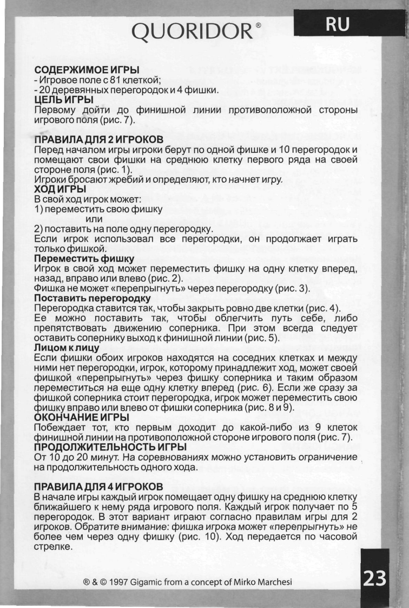
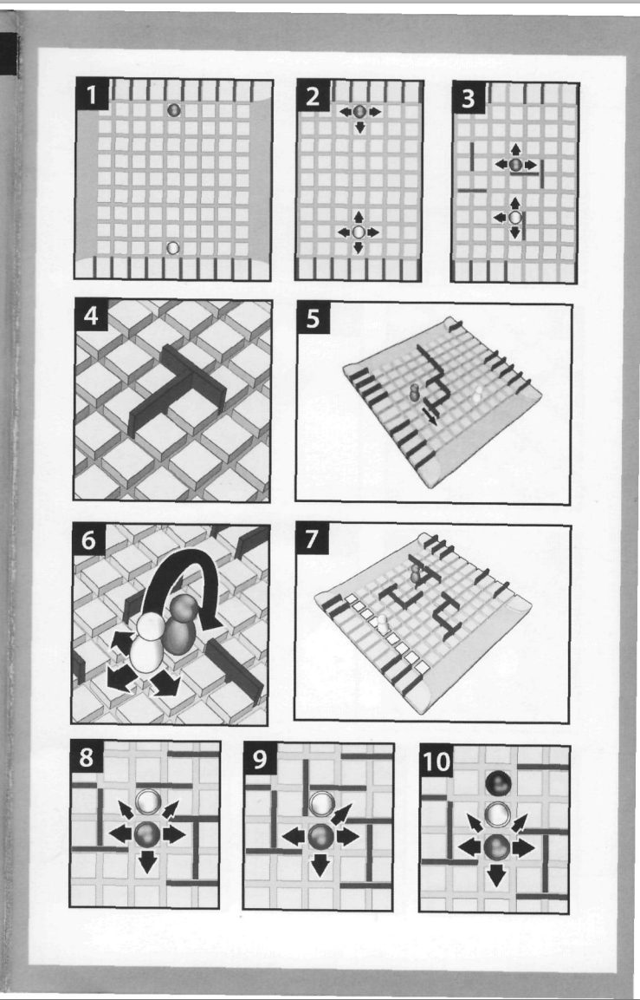

# Корпорация Sun
---

## Участники:

* Князькина Дарья
* Илья Соловьёв
* Лебедев Михаил
* Розаев Виктор 
* Факторович Андрей

## Предложение по технологиям:

Основа

* HTML5
* JavaScript
* Canvas

Система контроля версий

* git ([Вот хороший клиент](http://www.sourcetreeapp.com/))
* URL репозитория: `git@178.62.115.139:sun.git`

IDE

* [WebStorm](https://www.jetbrains.com/webstorm/download/) или [SublimeText](http://www.sublimetext.com/)

Тестирование:

* [QUnit](http://qunitjs.com/) ?
* [UnitJS](http://unitjs.com/) ?

CI:

* Jenkins?

Управление проектами 

* [redmine](http://178.62.115.139/)

## Обязанности, формат командной работы

* Князькина Дарья - Разработчик, пользовательская документация.
* Илья Соловьёв - Менеджер.
* Лебедев Михаил - Тестер.
* Розаев Виктор - Я. (Выбор технологий, настройка сервера, чай)
* Факторович Андрей - Разработчик.

## Идея приложения

### Игра "Лабиринт"

### Правила:

